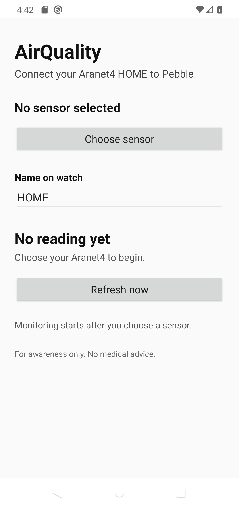

# Pebble projects

Pebble apps and watchfaces built for the modern Rebble SDK, with a focus on the
Pebble Time 2. Each product has its own install, usage, and development guide.

## Apps

### [AirQuality](apps/air-quality)

See live Aranet4 HOME air measurements, battery status, and rolling history on
your wrist. The Android companion reads the sensor directly over Bluetooth.


### [CPAP](apps/cpap)

Review the last seven nights of ResMed myAir scores, details, and trends without
opening the phone app.


### [Hubitat](apps/hubitat)

Check selected Hubitat sensors and control authorized switches and locks from
Pebble.


[Browse all apps →](apps)

## Watchfaces

### [Field Terminal](watchfaces/field-terminal)

A green phosphor field instrument with time, date, battery, and a brief
minute-change signal animation.


### [Casio Field Face](watchfaces/casio-field-face-c)

A restrained digital field-watch face with a large clock, compact date, and
high-contrast instrument styling.


[Browse all watchfaces →](watchfaces)

## Companion apps

[AirQuality Companion](companion_apps/air-quality-android) connects an Aranet4
HOME to the AirQuality Pebble app, imports sensor history, and keeps readings
flowing in the background.



[Browse companion apps →](companion_apps)

## Tools

- [Pebble Screenshot Tool](tools/pebble-screenshot-tool) captures deterministic
  emulator screenshots and lighting variants.
- [Pebble Watchface Toolkit](tools/pebble-watchface) provides templates,
  references, and validation helpers for new watchfaces.

[Browse all tools →](tools)

## Repository layout

```text
apps/              Pebble watchapps
watchfaces/        Pebble watchfaces and their design references
companion_apps/    Standalone phone companions
tools/             Shared development and visual QA tools
```

Generated PBWs, build directories, QA runs, caches, and private environment
files are intentionally excluded from Git.
