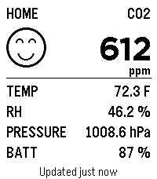

# Pebble apps

These are the interactive apps in this repository. Each one has its own setup,
usage guide, and development notes.

## [AirQuality](air-quality)

Current Aranet4 measurements and rolling history on Pebble.

## [CPAP](cpap)

Seven nights of ResMed myAir scores, details, and trends.

## [Hubitat](hubitat)

Quick access to selected home sensors, switches, and locks.

