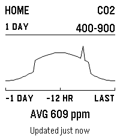
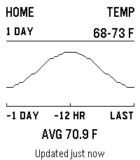
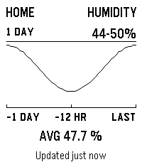
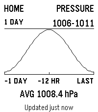

# AirQuality for Pebble

AirQuality puts the latest reading from an Aranet4 HOME on your Pebble. The
main screen shows CO2, temperature, humidity, pressure, and sensor battery. Four
chart screens cover the last hour, day, or week.


## Screens

| Current | CO2 | Temperature |
| :---: | :---: | :---: |
|  |  |  |
| Humidity | Pressure | |
|  |  | |

## Using the watch app

- Open AirQuality to refresh the current reading.
- Press Select on the main screen to refresh again.
- Press Up or Down to move between the current reading and four charts.
- Press Select on a chart to switch between one hour, one day, and one week.

The watch keeps the last good reading when the sensor or phone is unavailable.
The update line always shows how old that reading is.

## What you need

- An Aranet4 HOME with Smart Home integrations enabled in the Aranet Home app.
- An Android phone running the Pebble app.
- The [AirQuality Android companion](../../companion_apps/air-quality-android).

The companion talks directly to the sensor over Bluetooth. It does not need an
Aranet cloud account, API key, base station, or location permission on modern
Android. Readings stay on the phone and watch.

## Build and install

From the repository root:

```sh
cd apps/air-quality
npm test
npm run android:build
pebble build
```

Install the phone companion, then install `build/air-quality.pbw` on the watch:

```sh
adb install -r ../../companion_apps/air-quality-android/app/build/outputs/apk/debug/app-debug.apk
```

Open AirQuality Companion, allow Nearby devices and notifications, choose the
sensor, and pick the short name shown on the watch.

AirQuality is for awareness only and does not give medical advice.

See [DEVELOPMENT.md](DEVELOPMENT.md) for protocol details, chart behavior,
visual QA, architecture, and project identifiers.
