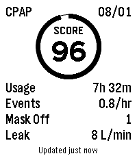
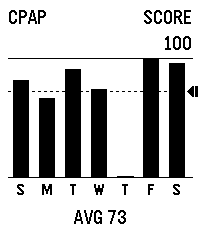
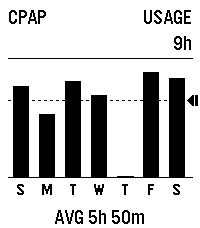
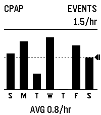
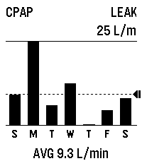

# CPAP for Pebble

CPAP shows seven nights of ResMed myAir results on Pebble Time 2. Each day has
the myAir score, usage, events per hour, mask-off count, and mask leak. Graphs
make it easy to spot changes across the week.


## Screens

| Nightly score | Score | Usage |
| :---: | :---: | :---: |
|  |  |  |
| Events | Leak | |
|  |  | |

## Using the watch app

- Open CPAP to see the most recent saved score.
- Press Up for older days and Down for newer days.
- Continue past the newest day to see weekly graphs.
- Press Select to refresh.

The watch saves the latest seven-day snapshot, so reopening the app usually
does not contact ResMed. Starting at 10 AM, it checks every two hours for a new
score and opens only when one arrives.

## Connect ResMed

Install `build/cpap.pbw`, then open CPAP Settings in the Pebble phone app. Enter
the email and password for a USA ResMed myAir account and tap Save. Return to
CPAP on the watch and press Select to make the first correlated refresh. No
computer or bridge server is needed after installation.

The credentials stay in CPAP's private PebbleKit JS storage on the phone. They
are never sent to the watch. PebbleKit JS cannot use the Android or iOS system
keychain, so anyone who does not want credentials stored there should not use
this app.

ResMed does not publish a supported patient myAir API. A ResMed service change
can break this integration without warning.

## Build

```sh
cd apps/cpap
npm test
pebble build
```

The installable file is `build/cpap.pbw`.

CPAP is not a medical device. Do not use it for diagnosis or treatment
decisions.

See [DEVELOPMENT.md](DEVELOPMENT.md) for refresh scheduling, diagnostics,
security boundaries, emulator workflows, and visual QA.
