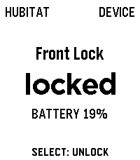
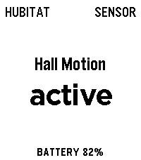
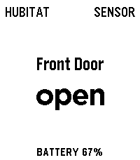
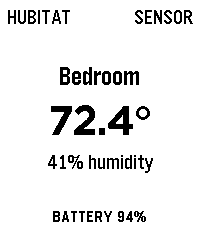

# Hubitat for Pebble

Hubitat brings a small set of home sensors and controls to Pebble Time 2. It can
show motion, contact, temperature, and battery readings. Authorized switches
and locks can also be controlled from the watch.


## Screens

| Lamp | Lock | Motion |
| :---: | :---: | :---: |
|  |  |  |
| Contact | Temperature | |
|  |  | |

## Using the watch app

- Press Up or Down to move between the overview and individual devices.
- Opening the app refreshes device states automatically.
- Press Select on the overview to refresh.
- Press Select on a switch to run the action shown at the bottom of the screen.
- Locks require a second Select press before the command is sent.

The app keeps the last successful update on the watch. Each launch shows the
normal syncing screen while it requests current device states. A failed refresh
shows the normal error/retry screen and leaves the saved data in place.

## Connect Hubitat

In Hubitat:

1. Add the built-in Maker API app.
2. Authorize only the devices this watch should read or control.
3. Enable the appropriate local or cloud endpoint and save the Maker API app.
4. Copy its access token.

Open Hubitat Settings in the Pebble phone app, paste the token, and save. Return
to the watch and press Select on the overview to sync.

Optional error reporting is available on the same settings page. It is off by
default. To enable it, create the shared **Diagnostic key** at
[pebble.exe.xyz](https://pebble.exe.xyz/diagnostics), paste that key into
Hubitat, and enable **Send errors to Pebble Diagnostics**. The key stays in the
phone runtime; the watch receives only the enabled bit.

The token stays in this app's private PebbleKit JS storage on the phone and is
never sent to the watch. Control commands are limited to on, off, lock, and
unlock. The app only controls device IDs returned by the latest authorized
Maker API refresh.

## Build

```sh
cd apps/hubitat
npm test
pebble build
```

The installable file is `build/hubitat.pbw`.

See [DEVELOPMENT.md](DEVELOPMENT.md) for Maker API behavior, error reporting,
fake and live QA, security rules, and project identifiers.
