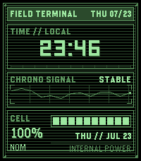
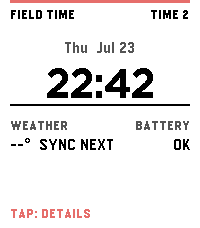
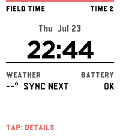
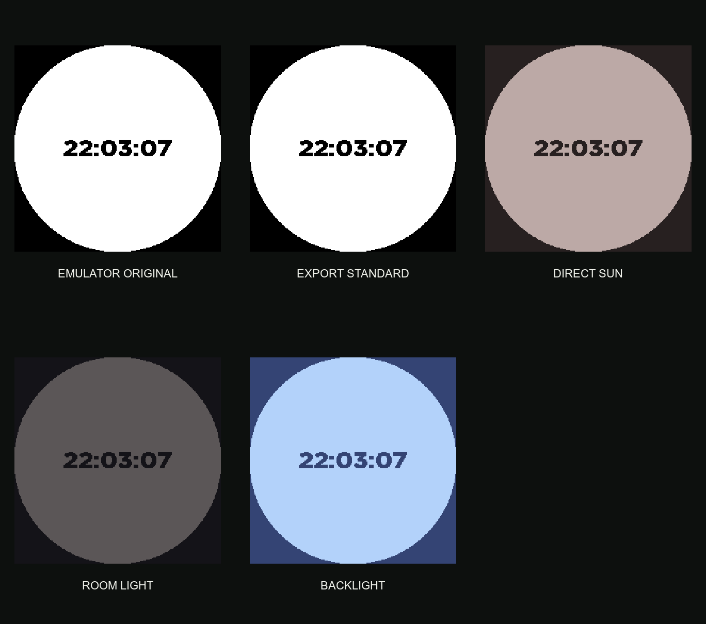

# Pebble watchfaces

The watchfaces are experiments and design studies rather than finished store
releases.

## [Field Terminal](field-terminal)

An experimental green phosphor field display for Pebble Time 2.

## [Casio Field Face](casio-field-face-c)

An experimental native C field-watch face with a large digital clock.

## [Casio Field Face Alloy prototype](casio-field-face)

The original embedded JavaScript prototype and its design studies.

## [Emulator Smoke Face](emulator-smoke-face)

A minimal Alloy face used to check Emery and Gabbro emulator support.

